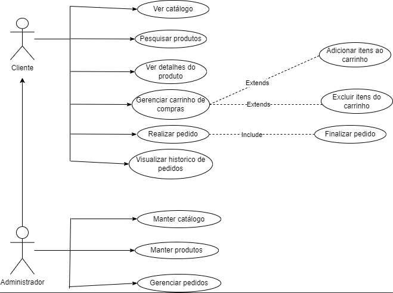

4\. Diagrama de Caso de Uso

4\.1 Descrição de Caso de Uso

Caso de Uso 1: Realiza Pedido

Ator Principal: Cliente

Objetivo: Permitir que os clientes naveguem pelo catálogo de produtos do pet shop, escolham os produtos desejados e realizem um pedido

Fluxo Principal:

1\. O cliente acessa o site do pet shop e faz login em sua conta.

2\. O cliente navega pelo catálogo de produtos, visualizando detalhes sobre os produtos, como nome, descrição e preço.

3\. O cliente seleciona um ou mais produtos que deseja comprar e os adiciona ao seu carrinho de compras.

4\. O cliente acessa o carrinho de compras para revisar os produtos selecionados, fazer alterações (adicionar, remover, atualizar a quantidade) e prosseguir para o processo de checkout.

5\. O cliente fornece informações de entrega, como endereço e método de pagamento.

6\. O sistema verifica a disponibilidade dos produtos, calcula o total da compra e processa o pagamento de acordo com o método escolhido pelo cliente.

7\. O cliente recebe uma confirmação do pedido, que inclui um número de pedido e informações de entrega estimada.

Fluxo Alternativo:

\- No passo 2, se o cliente não estiver logado, ele pode optar por se registrar como um novo cliente.

\- No passo 4, o cliente pode decidir cancelar o pedido ou continuar comprando antes de prosseguir para o checkout

Caso de Uso 2: Manter Produtos

Ator Principal: Administrador

Objetivo: Permitir que o administrador do site de pet shop gerencie o catálogo de produtos, adicionando novos produtos, editando informações existentes e removendo produtos obsoletos.

Fluxo Principal:

1\. O administrador faz login na área administrativa do site.

2\. O administrador navega até a seção de gerenciamento de produtos.

3\. O administrador pode adicionar novos produtos, fornecendo informações como nome, descrição, preço, categoria e imagens.

4\. O administrador pode editar informações de produtos existentes, como preço, descrição ou categoria.

5\. O administrador pode remover produtos que não estão mais disponíveis ou não são relevantes.

6\. O sistema atualiza automaticamente o catálogo de produtos no site para refletir as alterações feitas pelo administrador.

Fluxo Alternativo:

\- No passo 3, o administrador pode optar por adicionar produtos em lote, carregando um arquivo CSV ou XLS com informações de vários produtos de uma só vez.

\- No passo 4, se houver alterações significativas, como descontinuação de um produto, o administrador pode fornecer um motivo para a alteração.
